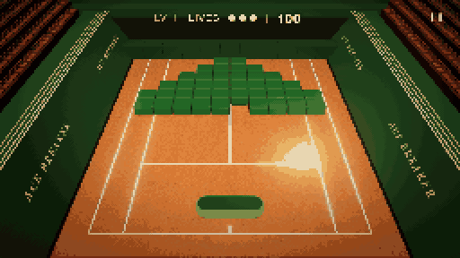

<div align="center">

# ACE BREAKER

<a href="https://moon-game-seven.vercel.app">
  
</a>

*Real gameplay capture — level 1, clay court.*

**A 3D arcade brick-breaker played on a floodlit clay court — 100% procedural.**

### [](https://moon-game-seven.vercel.app)

**Free to play in your browser — no install, no sign-up.**
[moon-game-seven.vercel.app](https://moon-game-seven.vercel.app)


</div>

---

## 🕹 THE GAME

Break every brick. Never let the ball past you. The field sits at the far end of
the court, you hold the near end, and the ball never stops — if it crosses the
line behind you, that's a life.

| Action | Mouse / Keys | Touch |
|:--|:--|:--|
| Move paddle | Click & **hold**, drag | Press & drag |
| Serve / restart | Click or <kbd>Space</kbd> | Tap |
| Dash | <kbd>Shift</kbd> or right-click | Double-tap |
| Pause / Mute | <kbd>P</kbd> · <kbd>Esc</kbd> / <kbd>M</kbd> | Pause button |

**3 lives.** The paddle moves in 2D, not on a rail — edge hits angle the ball up
to **58°**, and your own momentum transfers into it. Score is
`100 × brick multiplier × combo multiplier`.

---

## 📖 OVERVIEW

**Ace Breaker** is a browser game built entirely in code — no Blender, no
GLTF/GLB, no downloaded textures, no audio files. The stadium, bricks, rain,
lightning, sound effects and the 140 BPM soundtrack are all generated at runtime.

| | |
|:--|:--|
| 🧱 **8 brick types** | Normal · Armored (3 HP) · Explosive (chains) · Moving · Ghost (intangible while faded) · Multiplier (×3) · Powerup · Boss (24 HP) |
| 💊 **6 power-ups** | 22% drop rate — Racket XL · Multiball · Heavy Ball · Defensive Wall · Smash · Power Shot |
| 🔥 **Combo ladder** | `5→HOT ×2` · `12→ON FIRE ×3` · `25→BLAZING ×4` · `40→OVERDRIVE ×5`. Drives VFX and music, never ball speed. |
| 🌍 **6 worlds** | Rotates every 3 levels — or lock one from the ARENA picker. |
| 👑 **Boss levels** | Every 4th level: 24 HP core, guard ring, telegraphed laser. |
| ♾ **Endless levels** | Seeded and deterministic from 11 formation templates. |

<div align="center">


</div>

Weather is a real system — instanced rain streaks driven in the vertex shader,
wet clay that loses roughness as it rains, and storm lightning that **telegraphs
and then deals actual damage**. Two rules the codebase enforces: *no effect
without meaning*, and *every visual number lives in `VISUAL_CONFIG`*.

---

## 🧰 TECH STACK

| Layer | Choice |
|:--|:--|
| **Rendering** | Three.js r180 (WebGL 2), UnrealBloom + custom LDR grading pass, MSAA target |
| **Language** | TypeScript 5.6, strict — `tsc --noEmit` gates every build |
| **Build** | Vite 6 |
| **Audio** | Web Audio API — oscillators + filtered noise only, zero sample files |
| **Physics** | Hand-rolled deterministic X/Z arcade physics at a fixed 1/120 s step |
| **UI** | Plain HTML/CSS overlays over the canvas |
| **Debug** | lil-gui (dev builds / `?debug=1` only) |

**Runtime dependencies: 2** — `three` and `lil-gui`. Nothing else ships.

---

## 🚀 GETTING STARTED

> **Just want to play?** → **[moon-game-seven.vercel.app](https://moon-game-seven.vercel.app)**
> — nothing to install.
>
> The steps below are for the copyright holder and authorised collaborators
> only. This project is **not** open source — see [LICENSE.md](LICENSE.md).

**Requires Node 18+ and a WebGL 2 browser.**

```bash
npm install
npm run dev          # → http://localhost:5173
```

| Script | Does |
|:--|:--|
| `npm run dev` | Vite dev server with HMR |
| `npm run build` | Typecheck, then production build to `dist/` |
| `npm run typecheck` | Types only |
| `npm run preview` | Serve the production build |

<details>
<summary><b>Dev keys & URL params</b></summary>

<br>

<kbd>1</kbd>/<kbd>2</kbd> intro/gameplay camera · <kbd>O</kbd> orbit camera ·
<kbd>L</kbd> cycle lighting debug · `?debug=1` show the lil-gui panel ·
`?cam=gameplay|intro` force a camera state · `?shot=1` silent screenshot mode.

</details>

---

## 📁 PROJECT STRUCTURE

```
src/
├── config/visual.config.ts   # EVERY visual number (VISUAL_CONFIG)
├── core/                     # Experience (orchestrator), CameraRig, Lighting, Quality
├── environment/              # procedural stadium — Stadium, Worlds, Court, Stands…
├── game/                     # Game (state machine), Physics, LevelDirector,
│                             # FormationGenerator, Bricks, Ball, Paddle, Combo…
├── effects/                  # GameFeel (owns every impulse), Vfx, Rain, Lightning,
│                             # Particles, CameraShake, PostProcessing
├── audio/                    # AudioFx (SFX), Music (adaptive 140 BPM loop)
└── ui/                       # Screens (menus), Hud
```

`X` = left/right, `Y` = up, `Z` = near(+)/far(−). Court centre at the origin,
surface at `Y = 0`. Gameplay runs on the X/Z plane — frame-rate independent.

---

## 🔮 PLANNED

- **New brick types** — `SHIELDED`, `MAGNETIC`, `TELEPORT`, `CHAIN`,
  `REGENERATOR`, `LASER` are already reserved in `BrickType.ts`.
- **Persistent high scores** and a run-history screen.
- **More worlds** beyond the current six, on the same swap-not-retint pattern.
- **Daily seeded runs** — the level generator is already deterministic.
- **Code-splitting** — the bundle is one ~740 kB chunk today.

---

## 📄 LICENSE


**Ace Breaker is free to play, but it is not open source.**

| | |
|:--|:--|
| ✅ **Allowed** | Playing the hosted game at [moon-game-seven.vercel.app](https://moon-game-seven.vercel.app), for free, as much as you like |
| ❌ **Not allowed** | Copying, cloning, forking, reusing, modifying, redistributing or self-hosting the code — or any part of it — including in portfolios, tutorials or AI training data |

Copyright © 2026 Chandreshhere. All rights reserved.
Full terms: **[LICENSE.md](LICENSE.md)**. For permission, open an issue or reach
out on GitHub.

---

## 🙏 ACKNOWLEDGEMENTS

- Inspired by the **Lacoste × Roland-Garros "Ace Breaker"** web experience —
  rebuilt from scratch, procedurally.
- Built on [**Three.js**](https://threejs.org) and [**Vite**](https://vitejs.dev);
  debug UI by [**lil-gui**](https://lil-gui.georgealways.com).
- Preview GIF captured from a live build with Playwright, downsampled to
  pixel-art with ffmpeg.

> **Branding note:** all wordmarks are replacement branding ("ACE BREAKER").
> No proprietary Lacoste marks or assets are reproduced.

<details>
<summary><b>📜 Build log — 34 phases</b></summary>

<br>

**Phases 1–12 — core game**

- ✅ **1 — Procedural static environment**: court slab with procedural clay
  shader, real line geometry, extruded side walls, emissive gold trim rails,
  stepped stands, ~1,200 instanced seats, rear block wall + raked rear
  structure, replacement wordmark branding.
- ✅ **2 — Camera matching**: locked, config-driven PerspectiveCamera with
  `gameplay` and `intro` states, tuned against reference screenshots via a
  headless-browser screenshot loop. The court is deliberately depth-compressed
  vs a real tennis court, matching the reference's framing.
- ✅ **3 — Materials & lighting**: procedural clay/wall/seat materials; live
  tone-mapping comparison (ACES/AgX/Neutral) in the GUI.
- ✅ **4 — Game objects (static)**: rounded extruded paddle (lid + rim
  materials), BallRoot (emissive sphere + additive glow sprites + dynamic
  PointLight), instanced bevelled bricks from declarative level matrices.
- ✅ **5 — Physics & gameplay**: deterministic arcade physics on the X/Z plane
  at a fixed 1/120 s timestep — wall/rear/brick/paddle collisions,
  hit-position-steered paddle bounces (edge hits up to ~58°), forward-motion
  floor to kill horizontal loops, per-brick speed-up, lives, score, and a state
  machine (ready → playing → lifeLost → gameOver/win).
- ✅ **6 — The moving sun**: collision-reactive ball light (brick > paddle >
  wall pulse strengths with exponential decay), idle shimmer, speed-reactive
  pooled sprite trail, bloom rebalance — all live-tunable.
- ✅ **7 — Collision VFX**: pooled GPU spark particles (one `THREE.Points` draw
  call, zero per-hit allocations), per-instance white-hot brick flash before the
  squash, pooled impact point lights, trauma-based camera micro-shake, and
  floating score pops projected to screen space. `Vfx.ts` is the facade —
  gameplay reports what happened, VFX decides how it looks.
- ✅ **8 — Power-ups**: the six bonuses as colour-coded glowing capsules (22%
  per brick) — RACKET XL (width lerp, no model swap), MULTIBALL (true multi-ball
  physics), HEAVY BALL (pierces bricks, 1.8× scale), DEFENSIVE WALL, SMASH
  (beam wipes the nearest row), POWER SHOT (next hit at 115% max speed).
- ✅ **9 — UI**: full HTML/CSS screen flow — start screen, 6-bonuses explainer
  with inline-SVG icons, 3-2-1 countdown with auto-serve, pause, and results.
  HUD lives are tennis-ball dots. `?shot=1` runs a silent mode.
- ✅ **10 — Audio**: fully procedural Web Audio — oscillators + filtered noise,
  zero sample files. Distinct voices for paddle/wall/brick, shield, power-up
  arpeggio, serve swoosh, and win/loss stingers. Unlocks on first gesture.
- ✅ **11 — Mobile**: `touch-action: none` hygiene, a coarse-pointer perf tier
  (pixel ratio 1.5, 1024 shadow map), responsive HUD type via `clamp()`, and
  portrait-aware FOV so the side walls stay on-screen on phones.
- ✅ **12 — Final matching pass**: all eight game states captured and reviewed
  by a multi-agent adversarial workflow. Ball glow rescaled to a compact yellow
  hot spot, per-ball glow attenuation (1/√count) so multiball reads as distinct
  balls, capsules only catchable mid-rally, translucent backdrops with film
  grain, rails re-tuned to three thin gold lines, state-machine hardening
  (idempotent endGame, mid-step win guards), and full teardown.

**Phases 13–24 — arcade expansion**

- ✅ **13 — Advanced paddle control**: free X/Z movement inside a player zone
  (closest ~28%), smooth damped 2D chase, tracked paddle velocity on both axes.
  Dash: a 0.16 s burst toward the pointer with cooldown, green streak, camera
  impulse. The collision face is swept by its own Z velocity, so a dash into the
  ball can never phase through it.
- ✅ **17 — Life-lost cinematic**: 90 ms hitstop into 0.3× slow-motion recovery,
  sub-bass impact, music duck through a master low-pass, red screen-edge grading
  + desaturation + chromatic aberration pulse, ember burst at the loss point,
  the ball dissolving in place, the HUD life breaking away, then a respawn
  countdown. Hitstop / time-scale infrastructure lands here.
- ✅ **16 — GameFeelManager**: one central owner of every feel impulse —
  hitstop, time scale, camera shake, FOV punch, screen flash, vignette / bloom /
  aberration pulses, UI score punch, bass transients. Data-driven presets
  (TINY / NORMAL / HEAVY / CRITICAL / BOSS); every collision maps to one.
  Impulses compose with clamps and decay to exact neutral.
- ✅ **14 — LevelDirector + advanced bricks**: seeded deterministic levels from
  11 formation templates (PYRAMID, DIAMOND, SPIRAL, TUNNEL, FORTRESS, WINGS,
  SNAKE, RINGS, COLUMNS, CHECKERBOARD, RANDOM_CLUSTER). Seven brick types with
  readable visuals and real behaviour. Variety unlocks progressively (L1 pure
  NORMAL … L4+ full mix); levels 3+ get a reinforcement wave. One InstancedMesh
  per brick type.
- ✅ **15 — Combo + Overdrive**: tier ladder with a 6 s decay timer; ball loss
  resets, paddle contact does not. Combo emits a 0..1 energy value consumed
  everywhere — ball shimmer, trail length, spark size, sustained bloom — never
  ball speed. Overdrive gets slow-mo, a sawtooth riser, and a forced strike.
- ✅ **23 — Level-clear cinematic**: the final brick triggers CRITICAL/BOSS
  impact + slow-mo, balls park and glow, LEVEL CLEAR flash, then an animated
  results screen with an eased score count-up.
- ✅ **18 — Environments**: `EnvironmentDirector` cycles CLAY → NEON → HELL
  every three levels by rewriting themable config and rebuilding the stadium.
- ✅ **19+20 — Weather + lightning**: `WeatherManager` with recycled GPU
  particles — rain streaks and rising embers, density scaled by `intensity`.
  THUNDERSTORM adds procedural lightning with screen flash and
  distance-delayed thunder.
- ✅ **22 — Dynamic difficulty**: tension waves
  (INTRO→BUILD→PRESSURE→CLIMAX→RELEASE) feeding music and weather, plus gentle
  rubber-banding — struggling players get slower serves and 1.5× capsule drops.
  Never a linear speed ramp.
- ✅ **24 — Boss levels**: every 4th level — a 24 HP pulsing purple brick with
  an armoured guard ring and explosive flank columns. Three phases with
  BOSS-preset impacts; a telegraphed laser briefly stuns a stationary paddle.
  Heavy balls chip the boss instead of piercing it.
- ✅ **21 — Adaptive music**: a synthesized 140 BPM trap loop — six stems on
  their own gain buses (detuned pad, kick/snare, gliding 808 subs, velocity hats,
  minor pluck arp, sawtooth stabs) on a 16-step grid via a look-ahead scheduler.
  `musicIntensity` gates stems, with ramps applied **at bar boundaries** only.

**Phases 25–34 — the show**

- ✅ **25 — Lighting architecture rebuild**: `LightingDirector` composes five
  independent layers (base / readability / weather / power-up / impact) with
  hard floors. A camera-side no-shadow SpotLight guarantees readable brick
  faces. HEAVY BALL no longer paints the scene red — it warms the light within
  capped lerps while the ball carries the fire.
- ✅ **26 — Real rain**: `RainSystem` renders elongated streaks as ONE instanced
  draw call, all motion in the vertex shader (per-streak length/speed/opacity,
  three depth layers, smoothed wind with gusts, seeded density gating).
  `RainSplashSystem` adds pooled ground rings; `WetSurfaceController` drops the
  clay's roughness while raining. Two bugs fixed during bring-up: a
  shared-Vector2 wind uniform compounding gusts exponentially, and NaN fragments
  poisoning the bloom chain.
- ✅ **Smoothness pass**: hitstop got a 260 ms cooldown — chains keep every
  flash and spark but the clock stops at most ~4×/s (the freeze-spam WAS the
  perceived lag); score pops budgeted (≤7 DOM nodes); impact audio rate-limited
  per type; per-burst `THREE.Color` allocations hoisted. No animation removed.
- ✅ **27 — Lightning as gameplay**: `LightningBolt` (recursive
  midpoint-displacement bolt + probabilistic branches, geometry unique per
  strike and disposed) and `LightningDirector` (scenery vs gameplay strikes).
  Gameplay strikes telegraph for 300–700 ms, then land: direct damage (armour
  may soak), radial splash as plain hits, HEAVY impact + near-thunder.
- ✅ **28 — Cinematic camera trauma**: three separated channels from smooth
  summed-sine noise (never per-frame random) — positional sway + micro-vibration,
  clamped roll-dominant rotation, and sharp directional kicks. Magnitude =
  trauma². `screenShake` FULL/REDUCED/OFF scales all three plus FOV punches;
  OFF removes all motion while flashes, particles and audio remain.
- ✅ **29 — Settings & debug relocation**: the lil-gui panel no longer renders
  during normal play. A proper Settings screen exposes music/SFX volume, screen
  shake, bloom, and rain quality — applied live.
- ✅ **30–32 — Three more worlds**: **LOTUS//OS** (holographic lotus, grid walls,
  floating data panels, data-mote weather), **NEON ARCADE** (procedural cabinets
  with pixel-art screens, HI-SCORE marquee, confetti), **COMIC IMPACT** (halftone
  panels, extruded stars, pooled 3D BAM!/POW!/SMASH! word slams). The gameplay
  space is constant; the surrounding world geometry is fully swapped, not
  retinted.
- ✅ **33 — SpectacleDirector**: each level carries independent 0–1 spectacle
  targets staged inside its 3-level world block (build → pressure → climax).
  They scale weather, raise the music floor, and boost burst energy — so the
  show keeps peaks *and* valleys.
- ✅ **34 — Level-up sequence**: hitstop + boom + music duck at t0, a kinetic
  LEVEL COMPLETE slam at 0.35 s, the world's signature reaction at 1.1 s, then a
  results screen at 2.2 s with cascading stats — CLEAR TIME, MAX COMBO, and a
  +500 NO-MISS BONUS.
- ✅ **Arena select**: the ARENA button opens a picker with all six worlds plus
  AUTO CYCLE, applied instantly as a live preview behind the menu. HUD
  announcements now play through a single-slot queue with a minimum read time.
- ✅ **Graphics quality tiers**: LOW/MEDIUM/HIGH scale pixel-ratio cap
  (1 / 1.5 / 2), MSAA (0 / 2 / 4), bloom resolution (0.45× / 0.6× / 1×), shadows
  (off / 1024 PCF / 2048 PCF-soft), rain density and particle counts. **AUTO**
  picks a tier from device hints and steps *down* when smoothed frame time stays
  above ~26 ms for two seconds — never up, so it can't oscillate. Settings
  persist in localStorage.

**All phases 1–34 complete.** A final 12-agent adversarial review confirmed and
fixed six bugs pre-release: a field-clear softlock via stale pending kills,
dying-brick animations corrupting the next wave's instanced mesh, mute defeated
by pending duck automation, a music-scheduler burst after main-thread stalls,
the SMASH beam clobbering the boss telegraph (beams now carry priority), and
lightning bolt material leaks — plus chain-kills fizzling on death, difficulty
baselines at session/wave start, and boss telegraphs resetting across serves.

</details>

<div align="center">

### [▶ PLAY ACE BREAKER](https://moon-game-seven.vercel.app)

</div>
